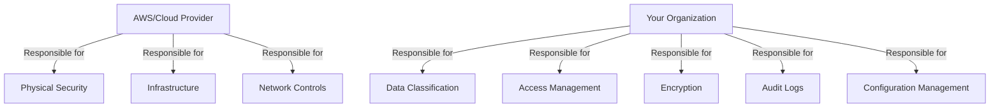

# HIPAA Compliance Framework

> A structured approach to understanding and implementing HIPAA requirements

---

## The Three Pillars of HIPAA

### 1. Privacy Rule

- **Purpose**: Regulates the use and disclosure of Protected Health Information (PHI)
- **Key Requirements**:
  - Patients' rights to access and control their health information
  - Minimum necessary standard for PHI disclosure
  - Notice of Privacy Practices requirements

### 2. Security Rule

- **Purpose**: Establishes standards for protecting electronic PHI (ePHI)
- **Core Components**:
  - Administrative, Physical, and Technical Safeguards
  - Required and Addressable implementation specifications
  - Risk analysis and management requirements

### 3. Breach Notification Rule

- **Requires**:
  - Notification of individuals affected by a breach
  - Notification to HHS for breaches affecting 500+ individuals
  - Notification to media in certain cases
  - Documentation and reporting requirements

---

## The Three Safeguards

### Administrative Safeguards

- **Policies & Procedures**: Documented security management process
- **Workforce Training**: Regular HIPAA and security awareness training
- **Risk Assessment**: Annual security risk analysis
- **Business Associate Agreements**: Required for all third-party vendors handling PHI

### Physical Safeguards

- **Facility Access Controls**: Limited physical access to ePHI
- **Workstation Security**: Policies for device and workstation use
- **Device and Media Controls**: Management of hardware and electronic media

### Technical Safeguards

- **Access Control**: Unique user identification, emergency access
- **Audit Controls**: Activity logs and monitoring
- **Integrity Controls**: Mechanisms to authenticate ePHI
- **Transmission Security**: Encryption for data in transit

---

## Cloud Compliance: Shared Responsibility Model

---

## Compliance is a Continuous Process

### Ongoing Requirements:

- **Regular Audits**: Internal and external security assessments
- **Policy Updates**: Annual review and revision of policies
- **Training**: Continuous workforce education
- **Monitoring**: Real-time security monitoring
- **Incident Response**: Preparedness and testing

### Common Audit Triggers:

1. **Complaints**: From patients or employees
2. **Breach Reports**: Especially those affecting 500+ individuals
3. **Random Audits**: Conducted by HHS OCR
4. **Whistleblower Reports**: From current or former employees
5. **Media Reports**: Of potential violations

---

## Next Steps

- [Backend Playbook](../03-backend-playbook/01-security-basics.md) for technical implementation
- [Frontend Playbook](../04-frontend-playbook/01-secure-development.md) for UI/UX considerations
- [Incident Response Plan](../03-backend-playbook/04-incident-response.md)

---

## Resources

- [HHS HIPAA Security Rule Guidance](https://www.hhs.gov/hipaa/for-professionals/security/index.html)
- [AWS HIPAA Compliance](https://aws.amazon.com/compliance/hipaa-compliance/)
- [NIST HIPAA Security Rule Toolkit](https://www.nist.gov/cyberframework/hipaa-security-rule)
